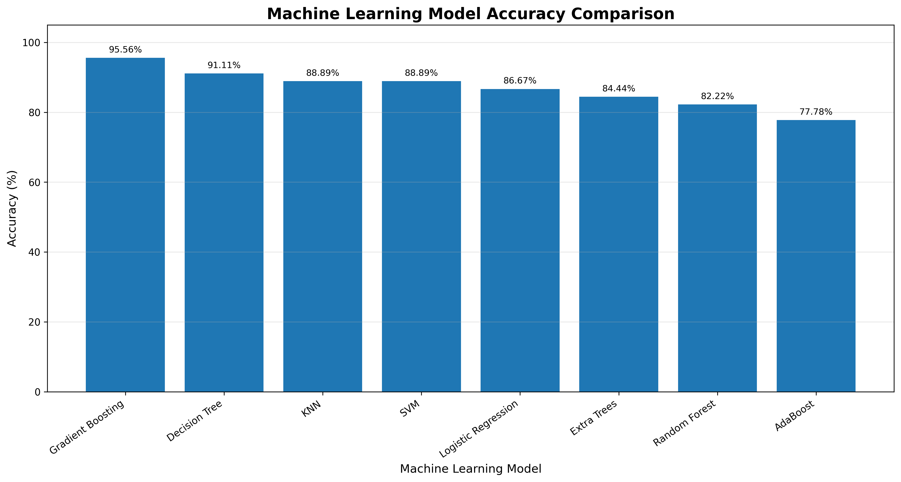

```markdown
# AI-Based Vegetable Production Pattern Analysis and Classification

## Overview

Vegetable production varies significantly across different geographical regions due to differences in agricultural conditions, cultivation practices, land availability, irrigation facilities, climate, and regional farming patterns.

This project presents an **AI-Based Vegetable Production Pattern Analysis and Classification System** designed to analyze taluk-level vegetable production data and classify regions according to their overall vegetable production intensity.

The project performs data preprocessing, feature engineering, production pattern analysis, machine learning model training, classification, prediction, performance evaluation, and visualization. In addition to the base machine learning models, optimization approaches based on **Artificial Immune System (AIS)** and **Particle Swarm Optimization (PSO)** are used for intelligent feature selection and model improvement.

The primary classification target is:

`Production_Category`

The target consists of three classes:

- `Low`
- `Medium`
- `High`

---

## Project Objective

The main objective of this project is to develop an intelligent machine learning system capable of analyzing regional vegetable production patterns and classifying taluks according to their overall production intensity.

The major objectives are:

- Analyze taluk-level vegetable production patterns.
- Clean and preprocess agricultural production data.
- Handle missing and inconsistent production values.
- Calculate total vegetable production for each taluk.
- Identify the dominant vegetable produced in each region.
- Classify regions into Low, Medium, and High production categories.
- Train multiple machine learning classification algorithms.
- Compare models using Accuracy, Precision, Recall, and F1 Score.
- Select the best-performing machine learning model.
- Generate production-category predictions.
- Apply Artificial Immune System optimization for feature selection.
- Apply Particle Swarm Optimization for feature selection.
- Generate graphical visualizations of model performance.
- Save trained models and metadata for future use.

---

## Dataset

The project uses the dataset:

`Production_of_Important_Vegetable_crops_In_Tonnes_2019_20.csv`

The dataset contains vegetable production information at the taluk level.

The main vegetable production attributes are:

- Potato
- Tomato
- Brinjal
- Beans
- Cluster Beans
- Onion
- Green chillies
- Total Leafy Vegetables
- Total Guard Variety Vegetables

---

## Dataset Features

| Feature | Description |
|---|---|
| Taluks | Name of the taluk or geographical region |
| Potato | Potato production in tonnes |
| Tomato | Tomato production in tonnes |
| Brinjal | Brinjal production in tonnes |
| Beans | Beans production in tonnes |
| Cluster Beans | Cluster beans production in tonnes |
| Onion | Onion production in tonnes |
| Green chillies | Green chilli production in tonnes |
| Total Leafy Vegetables | Total leafy vegetable production |
| Total Guard Variety Vegetables | Total guard variety vegetable production |

---

## Project Workflow

The complete workflow of the project is:

1. Load the vegetable production dataset.
2. Clean column names.
3. Remove completely empty records.
4. Remove aggregate records such as State Total.
5. Convert vegetable production attributes to numeric format.
6. Handle missing production values.
7. Calculate total vegetable production.
8. Identify the dominant vegetable for each taluk.
9. Generate Low, Medium, and High production categories.
10. Encode the target variable.
11. Split the dataset into training and testing sets.
12. Perform feature scaling.
13. Train multiple machine learning models.
14. Evaluate model performance.
15. Generate confusion matrix and performance graphs.
16. Select the best-performing model.
17. Generate result and prediction CSV files.
18. Apply AIS-based feature selection.
19. Apply PSO-based feature selection.
20. Save trained models and optimization results.

---

## Data Preprocessing

Several preprocessing techniques are applied before model training.

### Column Cleaning

Column names are cleaned by:

- Removing unnecessary spaces.
- Removing line breaks.
- Standardizing formatting.

This ensures that the attributes can be accessed consistently during analysis.

### Aggregate Row Removal

Aggregate records such as:

- `State Total`
- `Grand Total`
- `All India`

are removed.

These records represent summarized production rather than individual taluk-level observations and could distort machine learning results.

### Numeric Conversion

Vegetable production attributes are converted into numerical format.

Invalid values are converted into missing values and handled during preprocessing.

### Missing Value Handling

Rows where all vegetable production values are missing are removed.

Remaining missing values are replaced using the **median value** of the corresponding feature.

Median imputation is useful because it is less sensitive to extreme production values.

### Negative Value Handling

Vegetable production cannot logically be negative.

Therefore, negative production values are restricted to a minimum value of:

`0`

---

## Feature Engineering

Additional features are generated from the original vegetable production attributes.

The main engineered features are:

- `Total_Production`
- `Dominant_Vegetable`
- `Production_Category`

---

## Total Production

The total vegetable production of each taluk is calculated by adding production across all vegetable categories.

The calculation is:

`Total_Production = Potato + Tomato + Brinjal + Beans + Cluster Beans + Onion + Green Chillies + Total Leafy Vegetables + Total Guard Variety Vegetables`

This feature provides an overall representation of vegetable production intensity.

---

## Dominant Vegetable

The vegetable having the highest production value for each taluk is identified as the dominant vegetable.

For example:

If a taluk has:

- Potato = 500 tonnes
- Tomato = 2500 tonnes
- Onion = 1200 tonnes
- Brinjal = 800 tonnes

then:

`Dominant_Vegetable = Tomato`

This provides information about the most significant vegetable crop in each region.

---

## Production Category

The total production values are converted into three production categories:

- Low
- Medium
- High

Quantile-based classification is used to divide the dataset into approximately balanced groups.

The generated target variable is:

`Production_Category`

This converts the production analysis problem into a multiclass classification problem.

---

## Target Encoding

The production categories are converted into numerical labels using `LabelEncoder`.

An example encoding may be:

- High → 0
- Low → 1
- Medium → 2

The exact encoding is generated automatically by the LabelEncoder.

The fitted label encoder is saved for future prediction and decoding.

---

## Train-Test Split

The processed dataset is divided into:

- 80% Training Data
- 20% Testing Data

Stratified sampling is used to maintain similar proportions of Low, Medium, and High production categories in both datasets.

The project uses:

`random_state = 42`

to improve reproducibility.

---

## Feature Scaling

`StandardScaler` is used to standardize features for algorithms that are sensitive to feature magnitude.

Standardization follows:

`z = (x - mean) / standard deviation`

Scaling is applied particularly to:

- K-Nearest Neighbors
- Logistic Regression
- Support Vector Machine

Tree-based algorithms are trained using the original feature values.

---

## Machine Learning Models

The project evaluates multiple machine learning classification algorithms.

### Random Forest Classifier

Random Forest combines multiple decision trees to produce robust predictions.

It is effective for nonlinear datasets and can capture complex relationships between vegetable production attributes.

### Extra Trees Classifier

Extra Trees uses multiple highly randomized decision trees.

Additional randomness during feature and split selection can improve generalization.

### Gradient Boosting Classifier

Gradient Boosting trains models sequentially.

Each new learner attempts to correct errors made by previous learners.

### AdaBoost Classifier

AdaBoost combines multiple weak learners into a stronger classifier by focusing progressively on difficult observations.

### Decision Tree Classifier

Decision Tree creates hierarchical decision rules based on the production features.

It is simple to interpret and capable of modeling nonlinear relationships.

### K-Nearest Neighbors

KNN classifies a sample according to nearby observations in the feature space.

The project uses:

`K = 5`

### Logistic Regression

Logistic Regression provides a statistical baseline for multiclass production classification.

Scaled input features are used for Logistic Regression.

### Support Vector Machine

Support Vector Machine identifies decision boundaries separating the production classes.

An RBF kernel is used to capture nonlinear patterns.

---

## Model Evaluation Metrics

The machine learning models are evaluated using:

- Accuracy
- Precision
- Recall
- F1 Score

### Accuracy

Accuracy represents the percentage of correctly classified samples.

`Accuracy = Correct Predictions / Total Predictions`

### Precision

Precision measures how many observations predicted as a particular production category actually belong to that category.

### Recall

Recall measures how effectively the model identifies samples belonging to each actual production category.

### F1 Score

F1 Score provides a balance between Precision and Recall.

`F1 = 2 × (Precision × Recall) / (Precision + Recall)`

---

## Model Accuracy Visualization

The following graph compares the accuracy achieved by the machine learning classification models.



The graph provides a visual comparison of model performance and helps identify the models that provide the strongest classification results.

---

## Confusion Matrix

A confusion matrix is generated for the best-performing model.

It compares:

`Actual Production Category vs Predicted Production Category`

The confusion matrix helps identify correctly classified samples and misclassification patterns among Low, Medium, and High production regions.

---

## Model Comparison

All machine learning models are compared using:

- Accuracy
- Precision
- Recall
- F1 Score

The comparison graph provides a comprehensive visualization of classification performance across all evaluated algorithms.

---

## Result Generation

The project generates a `result.csv` file containing predictions for the testing dataset.

The result file contains:

- Taluk
- Total Production
- Dominant Vegetable
- Actual Category
- Predicted Category
- Correct Prediction

The associated result graph visually compares actual and predicted production categories.

---

## Prediction Generation

After model evaluation, the best-performing model is trained using the complete processed dataset.

The project generates:

`prediction.csv`

The prediction file contains:

- Taluk
- Total Production
- Dominant Vegetable
- Actual Category
- Predicted Category
- Prediction Status

The prediction graph compares the actual and predicted production classes across the complete dataset.

---

## Artificial Immune System

The project implements an **Artificial Immune System (AIS)** based feature-selection approach.

AIS is a nature-inspired optimization technique based on principles of the biological immune system.

The implementation uses concepts including:

- Antibodies
- Affinity
- Clonal selection
- Hypermutation
- Elite selection
- Population replacement

Each antibody represents a possible subset of vegetable production features.

For example:

`[1, 0, 1, 1, 0, 1, 0, 1, 0]`

where:

- `1` = Feature Selected
- `0` = Feature Rejected

The fitness or affinity of each antibody is evaluated using classification performance.

A small feature-count penalty is applied to encourage the selection of compact and informative feature subsets.

---

## AIS Clonal Selection

The AIS optimization process follows these steps:

1. Generate an initial population of antibodies.
2. Evaluate the affinity of every antibody.
3. Select high-affinity antibodies.
4. Clone the strongest antibodies.
5. Apply mutation to the cloned antibodies.
6. Evaluate the new antibodies.
7. Preserve high-quality solutions.
8. Introduce random antibodies to maintain population diversity.
9. Repeat the process for multiple generations.
10. Select the best feature subset.

---

## AIS Feature Selection

After optimization, the selected features are used to train the machine learning models.

AIS generates feature-selection information showing whether each feature is:

- Selected
- Rejected

AIS-specific files use the prefix:

`ais_`

Examples include:

- `ais_feature_selection.csv`
- `ais_feature_selection_graph.png`
- `ais_convergence_graph.png`
- `ais_accuracy_graph.png`
- `ais_heatmap.png`
- `ais_comparison_graph.png`
- `ais_result.csv`
- `ais_result_graph.png`
- `ais_prediction.csv`
- `ais_prediction_graph.png`

---

## Particle Swarm Optimization

The project also implements **Binary Particle Swarm Optimization (BPSO)** for feature selection.

Particle Swarm Optimization is inspired by the collective behavior observed in bird flocks, fish schools, and other biological populations.

Each particle represents a candidate subset of vegetable-production features.

For example:

`[1, 1, 0, 1, 0, 0, 1, 1, 0]`

where:

- `1` = Feature Selected
- `0` = Feature Rejected

---

## PSO Components

Each PSO particle contains:

- Current Position
- Current Velocity
- Personal Best Position
- Personal Best Fitness

The complete swarm also maintains:

- Global Best Position
- Global Best Fitness

Particles modify their positions based on their previous experience and the best solution discovered by the swarm.

---

## PSO Velocity Update

The particle velocity is updated using:

`v(t+1) = w × v(t) + c1 × r1 × (pbest - x) + c2 × r2 × (gbest - x)`

where:

- `w` = Inertia weight
- `c1` = Cognitive coefficient
- `c2` = Social coefficient
- `r1` = Random value
- `r2` = Random value
- `pbest` = Personal best position
- `gbest` = Global best position
- `x` = Current particle position

---

## Binary PSO

Because feature selection is a binary optimization problem, particle velocities are transformed into probabilities using the sigmoid function.

`S(v) = 1 / (1 + e^(-v))`

The probability determines whether the corresponding feature receives:

- `1` for Selected
- `0` for Rejected

---

## PSO Fitness Function

The PSO fitness function considers classification performance and the number of selected features.

Conceptually:

`Fitness = Cross-Validation Accuracy - Feature Selection Penalty`

The feature penalty discourages PSO from automatically selecting every available feature.

This allows PSO to search for smaller feature subsets while maintaining strong classification performance.

---

## PSO Convergence

The best fitness value discovered by PSO is recorded at every iteration.

The convergence graph represents:

`PSO Iteration vs Best Fitness`

This visualization demonstrates how the optimization algorithm improves or maintains the best solution during the search process.

---

## PSO Feature Selection

After PSO completes optimization, the global-best particle determines the final feature subset.

Each vegetable-production feature is marked as:

- Selected
- Rejected

The selected features are then used for final machine learning model training and evaluation.

PSO-specific outputs use the prefix:

`pso_`

Examples include:

- `pso_feature_selection.csv`
- `pso_feature_selection_graph.png`
- `pso_convergence_graph.png`
- `pso_accuracy_graph.png`
- `pso_heatmap.png`
- `pso_comparison_graph.png`
- `pso_result.csv`
- `pso_result_graph.png`
- `pso_prediction.csv`
- `pso_prediction_graph.png`

---

## Model Persistence

The trained model and related information are saved in multiple formats.

### H5

The HDF5 file stores model-related information such as:

- Feature names
- Selected features
- Target values
- Scaling parameters
- Optimization information
- Serialized machine learning model

The `.h5` file in this project acts as an HDF5 model container rather than a native TensorFlow/Keras model.

### PKL

The Pickle file stores Python objects including:

- Trained model
- Scaler
- Label encoder
- Selected features
- Model metadata

### JSON

The JSON file stores readable information such as:

- Project name
- Best model
- Accuracy
- Features
- Classes
- Model evaluation metrics
- Optimization parameters

### YAML

The YAML file provides another human-readable representation of model configuration and project metadata.

---

## Base Model Output Files

The standard machine learning implementation generates:

- `vegetable_production_model.h5`
- `vegetable_production_model.pkl`
- `vegetable_production_model.json`
- `vegetable_production_model.yaml`
- `scaler.pkl`
- `label_encoder.pkl`
- `processed_vegetable_data.csv`
- `accuracy_graph.png`
- `heatmap.png`
- `comparison_graph.png`
- `result.csv`
- `result_graph.png`
- `prediction.csv`
- `prediction_graph.png`

---

## AIS Output Files

The Artificial Immune System implementation generates:

- `ais_vegetable_model.h5`
- `ais_vegetable_model.pkl`
- `ais_vegetable_model.json`
- `ais_vegetable_model.yaml`
- `ais_scaler.pkl`
- `ais_label_encoder.pkl`
- `ais_processed_data.csv`
- `ais_feature_selection.csv`
- `ais_feature_selection_graph.png`
- `ais_convergence_graph.png`
- `ais_accuracy_graph.png`
- `ais_heatmap.png`
- `ais_comparison_graph.png`
- `ais_result.csv`
- `ais_result_graph.png`
- `ais_prediction.csv`
- `ais_prediction_graph.png`

---

## PSO Output Files

The Particle Swarm Optimization implementation generates:

- `pso_vegetable_model.h5`
- `pso_vegetable_model.pkl`
- `pso_vegetable_model.json`
- `pso_vegetable_model.yaml`
- `pso_scaler.pkl`
- `pso_label_encoder.pkl`
- `pso_processed_data.csv`
- `pso_feature_selection.csv`
- `pso_feature_selection_graph.png`
- `pso_convergence_graph.png`
- `pso_accuracy_graph.png`
- `pso_heatmap.png`
- `pso_comparison_graph.png`
- `pso_result.csv`
- `pso_result_graph.png`
- `pso_prediction.csv`
- `pso_prediction_graph.png`

---

## Project Structure

    AI-Based Vegetable Production Pattern Analysis and Classification/
    │
    ├── Production_of_Important_Vegetable_crops_In_Tonnes_2019_20.csv
    ├── README.md
    ├── main.ipynb
    │
    ├── accuracy_graph.png
    ├── heatmap.png
    ├── comparison_graph.png
    ├── result.csv
    ├── result_graph.png
    ├── prediction.csv
    ├── prediction_graph.png
    │
    ├── vegetable_production_model.h5
    ├── vegetable_production_model.pkl
    ├── vegetable_production_model.json
    ├── vegetable_production_model.yaml
    │
    ├── ais_feature_selection.csv
    ├── ais_feature_selection_graph.png
    ├── ais_convergence_graph.png
    ├── ais_accuracy_graph.png
    ├── ais_heatmap.png
    ├── ais_comparison_graph.png
    ├── ais_result.csv
    ├── ais_result_graph.png
    ├── ais_prediction.csv
    ├── ais_prediction_graph.png
    │
    ├── pso_feature_selection.csv
    ├── pso_feature_selection_graph.png
    ├── pso_convergence_graph.png
    ├── pso_accuracy_graph.png
    ├── pso_heatmap.png
    ├── pso_comparison_graph.png
    ├── pso_result.csv
    ├── pso_result_graph.png
    ├── pso_prediction.csv
    └── pso_prediction_graph.png

---

## Technologies Used

The project uses the following technologies and libraries:

- Python
- Pandas
- NumPy
- Matplotlib
- Scikit-learn
- H5Py
- PyYAML
- Pickle
- JSON
- Jupyter Notebook

---

## Installation

Install the required Python packages using:

`pip install pandas numpy matplotlib scikit-learn h5py pyyaml`

---

## Running the Project

Place the dataset inside the project directory.

Update the dataset path if necessary.

Example:

`C:\Users\sagni\Downloads\AI-Based Vegetable Production Pattern Analysis and Classification\Production_of_Important_Vegetable_crops_In_Tonnes_2019_20.csv`

Run the Python script or Jupyter Notebook.

For Python:

`python main.py`

For Jupyter Notebook:

`jupyter notebook`

Execute all cells sequentially to perform preprocessing, training, optimization, evaluation, prediction, and visualization.

---

## Key Features

The major features of the project include:

- Taluk-level vegetable production analysis.
- Automated data preprocessing.
- Missing-value handling.
- Aggregate record removal.
- Total production calculation.
- Dominant vegetable identification.
- Low, Medium, and High production classification.
- Multiple machine learning classifiers.
- Accuracy evaluation.
- Precision evaluation.
- Recall evaluation.
- F1 Score evaluation.
- Confusion matrix analysis.
- Actual vs predicted visualization.
- Artificial Immune System feature selection.
- AIS clonal selection and hypermutation.
- AIS convergence visualization.
- Binary Particle Swarm Optimization.
- PSO convergence visualization.
- PSO feature-selection visualization.
- Model serialization.
- CSV result generation.
- Prediction generation.
- Automated graph generation.

---

## Applications

The project can be useful for:

- Agricultural production pattern analysis.
- Regional vegetable production comparison.
- Identification of high-production regions.
- Identification of dominant vegetable crops.
- Agricultural data visualization.
- Data-driven agricultural research.
- Machine learning experimentation.
- Nature-inspired optimization research.
- Agricultural planning support.
- Regional crop-production studies.

---

## Limitations

The production categories in this project are generated from the total vegetable production values contained in the same dataset.

Therefore, the project primarily demonstrates **vegetable production pattern analysis and classification** rather than independent future production forecasting.

Model performance depends on:

- Dataset size.
- Data quality.
- Available vegetable production features.
- Missing-value handling.
- Classification thresholds.
- Train-test split.
- Model hyperparameters.
- AIS parameters.
- PSO parameters.

For real-world forecasting, historical multi-year data and independent agricultural variables would be required.

---

## Future Scope

The project can be extended by incorporating additional agricultural variables such as:

- Rainfall
- Temperature
- Soil characteristics
- Irrigation availability
- Fertilizer usage
- Cultivated area
- Crop yield
- Market prices
- Seasonal information
- Geographical coordinates
- Historical production records

Future machine learning extensions could include:

- XGBoost
- LightGBM
- CatBoost
- Artificial Neural Networks
- Deep Neural Networks
- LSTM
- Time-Series Forecasting
- Hybrid AIS-PSO Optimization
- Genetic Algorithms
- Bayesian Optimization
- SHAP Explainable AI
- GIS-based production maps
- Interactive dashboards

---

## Conclusion

The **AI-Based Vegetable Production Pattern Analysis and Classification** project demonstrates how machine learning and nature-inspired optimization techniques can be applied to agricultural production datasets.

The system preprocesses taluk-level vegetable production records, handles missing data, calculates total production, identifies dominant vegetables, and creates Low, Medium, and High production categories.

Multiple machine learning algorithms are trained and evaluated using Accuracy, Precision, Recall, and F1 Score. The best-performing model is selected for final prediction and analysis.

The project further extends conventional machine learning through **Artificial Immune System (AIS)** and **Particle Swarm Optimization (PSO)** based feature selection. AIS uses clonal selection and mutation concepts, while PSO uses swarm intelligence and global optimization to identify informative feature subsets.

The generated accuracy graphs, confusion matrices, model comparison graphs, result CSV files, prediction files, feature-selection visualizations, convergence graphs, and serialized models provide a complete machine learning workflow for analyzing regional vegetable production patterns.

---

## Visualization


---

## Author

**Sagnik Patra**

Software Developer & Instructor

---

## License

This project is intended for **educational, academic, and research purposes**.
```
